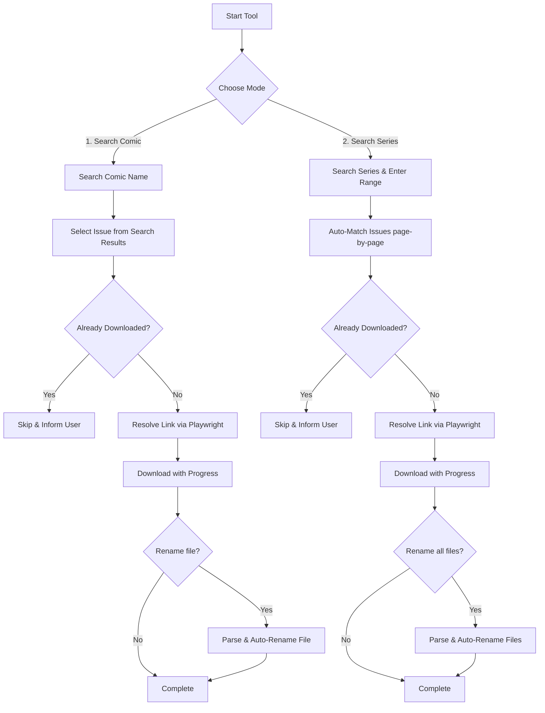

# 📚 Comic Book Downloader

[](https://www.python.org/)
[](LICENSE)
[]()

A terminal-based Python tool to search, download, and automatically rename comics from [GetComics.org](https://getcomics.org). 

Supports single-issue downloads and automated series run downloads.

---

## ✨ Features

- 🔍 **Interactive Search:** Search and browse comics by name directly from the terminal.
- 📦 **Bulk / Series Downloads:** Automatically search and download a sequence of issues (e.g., `1-10`) without manual selection.
- 🔗 **Smart Link Resolution:** Automatically resolves GetComics download redirects and retrieves files via Playwright Chromium.
- 🛡️ **Duplicate Detection:** Scans the target folder and automatically skips downloading files that already exist locally.
- 🗃️ **Format Support:** Full compatibility with standard `.cbz` and `.cbr` comic archives.
- 🏷️ **Optional Renaming:** Clean up raw file naming conventions into a standardized format:
  `Ultimate Spider-Man #1 (2024).cbz`

---

## 🛠️ Architecture Workflow

Here is how the downloader handles matching, redirection, and downloads:



---

## 📋 Requirements

*   **Python:** Version `3.10` or higher is recommended (Download latest version [here](https://www.python.org/downloads/)).
*   **Playwright:** Required for headless browser scraping to bypass JS download redirects.
*   **Active Internet Connection**

---

## 🚀 Installation & Setup

Choose the installation instructions corresponding to your operating system below:

### 🪟 Windows Setup

1. **Clone the Repository:**
   ```bash
   git clone https://github.com/moistfella/comic-book-downloader.git
   cd comic-book-downloader
   ```

2. **Run the Installer:**
   Double-click `install.bat` or run it from the command line:
   ```cmd
   install.bat
   ```
   > `install.bat` automatically upgrades `pip`, installs the required dependencies (`requests`, `beautifulsoup4`, `playwright`), and initializes the Playwright browser binaries.

3. **Launch the Application:**
   ```cmd
   run.bat
   ```

---

### 🐧 Linux Setup

1. **Clone the Repository:**
   ```bash
   git clone https://github.com/moistfella/comic-book-downloader.git
   cd comic-book-downloader
   ```

2. **Run the Installer:**
   Grant execute permissions and run the install script from the terminal:
   ```bash
   chmod +x install.sh run.sh
   ./install.sh
   ```
   > `install.sh` automatically creates a Python virtual environment (`env`), activates it, installs the required dependencies (`requests`, `beautifulsoup4`, `playwright`), and initializes the Playwright browser binaries.

3. **Launch the Application:**
   ```bash
   ./run.sh
   ```

---

## 📖 Usage Instructions

Upon launching, the interactive menu will prompt you for an option:

| Option | Mode | Description |
| :---: | :--- | :--- |
| **`1`** | **Search comic** | Search for a comic name and select a specific issue from results to download. |
| **`2`** | **Search Series** | Automatically scans and downloads a specified range of issues (e.g., `1-10`). |

### Download Modes in Action

#### 🔹 Single Issue Download
1. Enter `1` at the prompt.
2. Enter the name of the comic (e.g., `Ultimate Spider-Man`).
3. Select your issue from the search results (page through results with `N` / `P`).
4. Follow the prompt to automatically rename or keep the default name.

#### 🔹 Series Download
1. Enter `2` at the prompt.
2. Enter the name of the comic series (e.g., `Ultimate Spider-Man`) and select the series from the search results.
3. Define the range when prompted (e.g., `1-10`).
4. The tool will automatically look up, match, and download the selected range.

#### 🔹 Automatic Renaming Format
At the end of a download run, choose the rename option to standardize the files:
*   **Original:** `Ultimate Spider-Man 001 (2024) (Digital) (Shan-Empire).cbz`
*   **Renamed:** `Ultimate Spider-Man #1 (2024).cbz`
*   **Volume Format:** `Ultimate Spider-Man Vol. 1 - Subtitle (2024).cbz`

> [!TIP]
> You can press `Ctrl + C` at any time to safely exit the application.
> 
> *Note on Mirrors:* The scraper attempts to resolve multiple mirrors. If a download fails or times out, it is usually because the target hosting mirror (e.g., Zippyshare) has gone offline or the host server is unresponsive.

---

## ⚖️ License

This project is licensed under the [MIT License](LICENSE).
